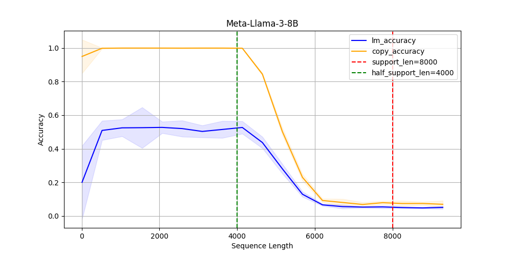

# Forgetting Curve
Our paper [Forgetting Curve: A Reliable Method for Evaluating Memorization Capability for Long-context Models](https://arxiv.org/abs/2410.04727) has been accepted by [EMNLP 2024 main](https://2024.emnlp.org/program/accepted_main_conference/).

## Method


## Results


The picture of their forgetting curve at [Picture](#Picture) 

[2024.10.9] We have newly tested [TTT](#TTT) and [RWKV](#RWKV)

# Usage
## Quick start
You can use our code online in this [notebook](https://www.kaggle.com/code/fallingflower/forgettingcurve).

- [English](#forgetting-curve)
- [中文](#遗忘曲线)


# Forgetting Curve


## Table of Contents
- [Environment Setup](#environment-setup)
- [Model Preparation](#model-preparation)
- [Drawing Forgetting Curves for Open-source Language Models on Hugging Face](#drawing-forgetting-curves-for-open-source-language-models-on-hugging-face)
- [Drawing Forgetting Curves for Custom Models](#drawing-forgetting-curves-for-custom-models)

## Environment Setup
```
git clone https://github.com/1azybug/ForgettingCurve.git
cd ForgettingCurve
conda create -n forget python=3.10 -y
conda activate forget
# [cuda12.1 for xformers installation] https://github.com/facebookresearch/xformers?tab=readme-ov-file#installing-xformers
conda install pytorch==2.2.0 pytorch-cuda=12.1 -c pytorch -c nvidia
pip3 install -U xformers --index-url https://download.pytorch.org/whl/cu121 -i https://pypi.tuna.tsinghua.edu.cn/simple

pip install -r requirements.txt -i https://pypi.tuna.tsinghua.edu.cn/simple
```

## Model Preparation
(Optional) You can refer to download.py to download models in advance. Some models require an HF Token, such as meta-llama/Meta-Llama-3-8B
```
HF_API_TOKEN="your_access_token" python download.py
```

## Drawing Forgetting Curves for Open-source Language Models on Hugging Face

`model_id` is the model on Hugging Face

`--repeat_time` controls the number of times each length is tested repeatedly

`--granularity` controls the number of equally divided points

`--granularity_type` "linear" means the length increases linearly, "log" means the length increases exponentially

`--test_max_length` represents the maximum length for testing

`--training_len` draws a reference line, generally the training length

The following code draws the forgetting curve of meta-llama/Meta-Llama-3-8B within a dependency length of 16000 (actually the longest token sequence reaches 32000). It tests every 16000/32 length, repeated 10 times.
```
model_id="meta-llama/Meta-Llama-3-8B"
title=$(basename "$model_id" | cut -d'/' -f2)
CUDA_VISIBLE_DEVICES=0,1,2,3 python draw.py \
    --model_id $model_id \
    --title $title \
    --repeat_time 10 \
    --granularity 32 \
    --granularity_type "linear" \
    --data_type "order" \
    --test_max_length 16000 \
    --training_len 8000 \
    --save_path "." \
    --device "cuda"
```


For drawing forgetting curves of more models, please refer to test.sh

## Drawing Forgetting Curves for Custom Models
```
from draw import evaluate
evaluate(model, tokenizer, texts_or_ids=test_tokens, config=config)
```
`model`: custom model

`tokenizer`: corresponding tokenizer for the model, not needed when `texts_or_ids` is a token sequence tensor of shape `[S]`

`texts_or_ids`: can be a token sequence `tensor` after tokenization, `str`, or `List[str]`

For ordinary Transformer models, config is not needed.

For segment-level recurrent Transformers, you can implement a `teacher_forcing_forward` function in `config` for faster and more efficient inference, see [example.py](./example.py "example.py") for details.

The input of `teacher_forcing_forward` is `model`, `prompt_ids`, and the output is `predicted_token_ids`.

# 遗忘曲线
一种可靠的方法来评估所有长上下文模型的记忆能力

## 目录
- [环境配置](#环境配置)
- [模型准备](#模型准备)
- [绘制在Hugging Face上开源的语言模型的遗忘曲线](#绘制在hugging-face上开源的语言模型的遗忘曲线)
- [绘制自定义模型的遗忘曲线](#绘制自定义模型的遗忘曲线)

## 环境配置
```
git clone https://github.com/1azybug/ForgettingCurve.git
cd ForgettingCurve
conda create -n forget python=3.10 -y
conda activate forget
# [cuda12.1 用于 xformers安装] https://github.com/facebookresearch/xformers?tab=readme-ov-file#installing-xformers
conda install pytorch==2.2.0 pytorch-cuda=12.1 -c pytorch -c nvidia
pip3 install -U xformers --index-url https://download.pytorch.org/whl/cu121 -i https://pypi.tuna.tsinghua.edu.cn/simple

pip install -r requirements.txt -i https://pypi.tuna.tsinghua.edu.cn/simple
```

## 模型准备
(可选)可以参考download.py预先下载模型，有些模型需要HF的Token，如meta-llama/Meta-Llama-3-8B
```
HF_API_TOKEN="your_access_token" python download.py
```

## 绘制在Hugging Face上开源的语言模型的遗忘曲线

`model_id`为Hugging Face上的模型

`--repeat_time` 控制每个长度重复测试的次数

`--granularity` 控制等分点的数量

`--granularity_type` "linear"表示长度线性增长，"log"表示长度以指数增长

`--test_max_length` 表示测试的最大长度

`--training_len` 绘制一个参考线，一般为训练长度

下面的代码表示绘制meta-llama/Meta-Llama-3-8B在依赖长度16000以内（实际上最长的token序列达32000）的遗忘曲线。每16000/32长度进行测试，重复测试10次。
```
model_id="meta-llama/Meta-Llama-3-8B"
title=$(basename "$model_id" | cut -d'/' -f2)
CUDA_VISIBLE_DEVICES=0,1,2,3 python draw.py \
    --model_id $model_id \
    --title $title \
    --repeat_time 10 \
    --granularity 32 \
    --granularity_type "linear" \
    --data_type "order" \
    --test_max_length 16000 \
    --training_len 8000 \
    --save_path "." \
    --device "cuda"
```


更多模型的遗忘曲线绘制可以参考test.sh

## 绘制自定义模型的遗忘曲线
```
from draw import evaluate
evaluate(model, tokenizer, texts_or_ids=test_tokens, config=config)
```
`model`:自定义的模型

`tokenizer`:模型对应的分词器，当texts_or_ids是形状为[S]的token序列张量时不需要传入

`texts_or_ids`：可以是分词后的token序列张量、str或List[str]

对于普通的Transformer模型来说不需要使用config。

而对于segment-level循环的Transformer可以在config里实现一个teacher_forcing_forward的函数以进行更快更省的推理，详见example.py。

`teacher_forcing_forward`的输入是`model`, `prompt_ids`，输出是`predicted_token_ids`。

# Picture


### TTT


### RWKV


